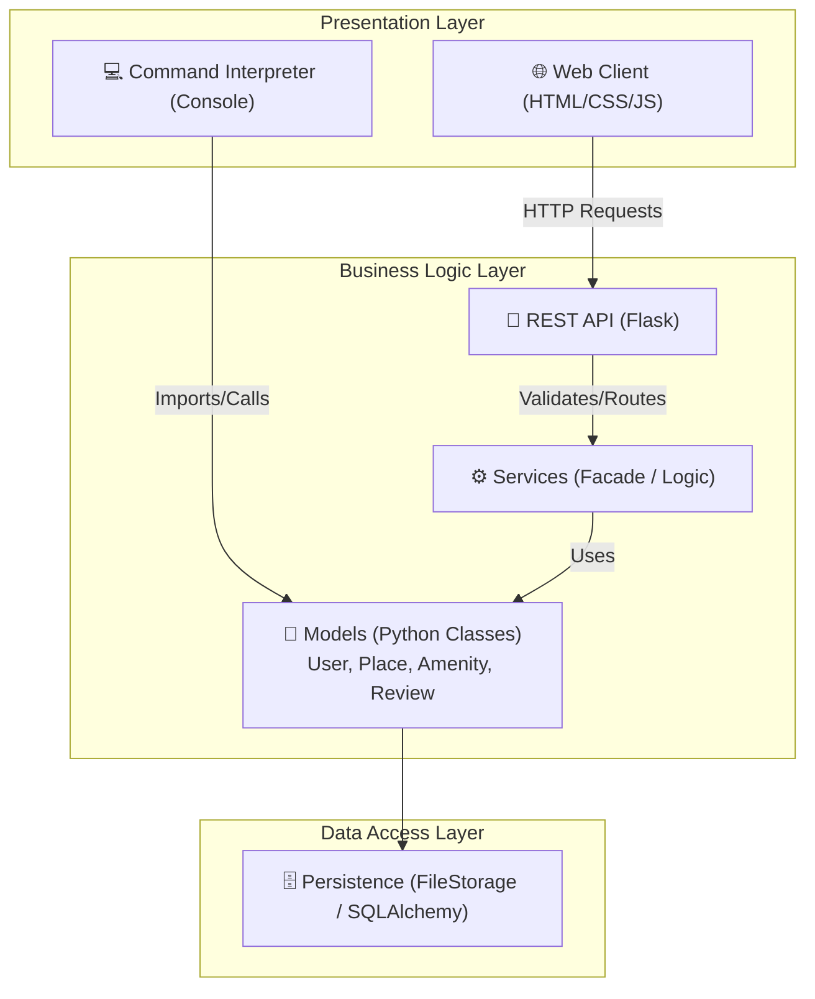
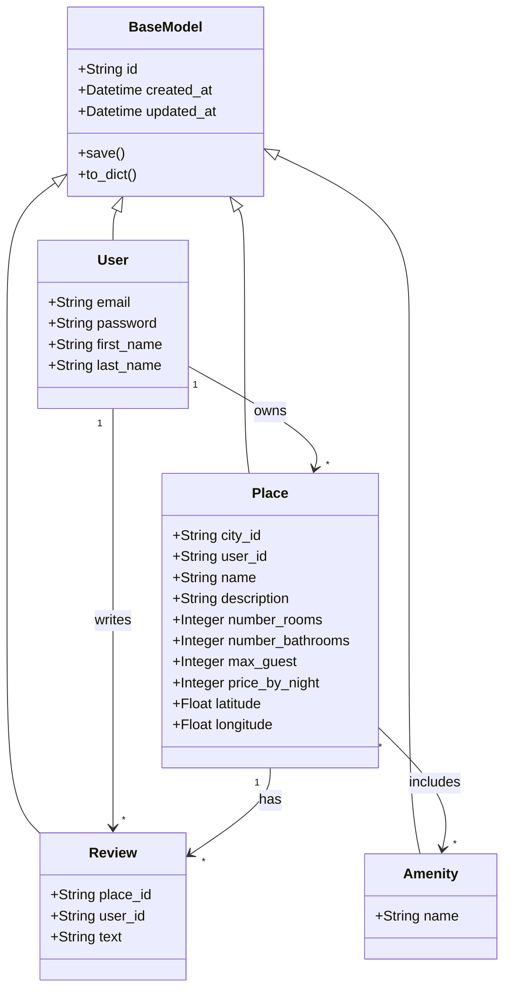
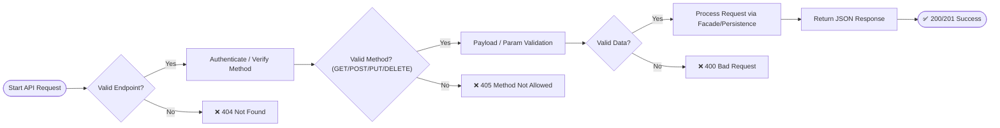

<div align="center">
  <h1>HBNB - AirBnB Clone Project</h1>
  <p>A complete full-stack web application clone of AirBnB.</p>
</div>

---

## Summary
- [Description](#description)
- [Architecture & Diagrams (Part 1)](#architecture--diagrams-part-1)
- [Features](#features)
- [Structure-project](#structure-project)
- [Installation](#installation)
- [Testing](#testing)
- [Documentation API](#documentation-api)
- [Technologies used](#technologies-used)
- [Authors](#authors)

---

## Description
HBNB is a comprehensive full-stack clone of the AirBnB web application. It breaks down into several iterations, from UML design and static HTML/CSS to Python backend infrastructure, RESTful APIs, databases, and a dynamic frontend. The console (command interpreter) manages the operational models, allowing the creation, updating, and deletion of users, places, amenities, and reviews.

---

## Architecture & Diagrams (Part 1)
As requested in Phase 1, the core architecture is designed to support the entire platform's scalability and component separation. You can also view the original compiled document here: [HBNB Part 1 Document](./part1/HBNB.pdf).

### 1. High-Level Architecture
The system is divided into layers: Presentation (Web Web GUI/Console), Business Logic (Python Services), and Persistence (File/Database Storage).



### 2. Business Logic / Class Diagram
A UML representation of the core objects that drive HBNB.



### 3. API Routing Flowchart
The process flow of how API requests are handled by the Flask application.



---

## Features
* **Modular Codebase**: Clean separation of persistence from business logic.
* **REST API**: Fully-functional V1 REST API using Flask namespace (`/api/v1/...`).
* **Object Persistence**: Store and load data using a robust Data Access pattern.
* **Console Integration**: Interact directly with backend components securely.

---

## Structure-project
```text
holbertonschool-hbnb/
├── part1/
│   └── HBNB.pdf
├── part2/
│   └── hbnb/
│       ├── app/
│       │   ├── api/       # API endpoints (users, places, reviews, amenities)
│       │   ├── models/    # Core business objects
│       │   ├── persistence/
│       │   ├── services/  # Application logic (Facade)
│       │   ├── config.py
│       │   └── run.py     # Main application entry point
│       └── tests/         # Unit and integration tests
├── .gitignore
└── README.md
```

---

## Installation
- Requirements: Python 3.8+
- Open your preferred Terminal.
- Clone this repository:
```bash
git clone https://github.com/Alistair31/holbertonschool-hbnb.git
```
- Navigate to the app directory:
```bash
cd holbertonschool-hbnb/part2/hbnb/app
```
- Install dependencies:
```bash
pip install -r requirements.txt
```
- Run the API:
```bash
python3 app.run
```

---

## Testing
The application uses the `unittest` framework to validate all objects, APIs, and persistence modules.

- **Run all tests**:
```bash
cd part2/hbnb/
python3 -m unittest discover tests
```

---

## Documentation API
The API handles standard CRUD operations grouped under `/api/v1/`.

| Method | Endpoint | Description |
| --- | --- | --- |
| **GET** | `/api/v1/users/` | Retrieves all users |
| **POST** | `/api/v1/users/` | Creates a new user |
| **GET** | `/api/v1/places/` | Retrieves a specific place |
| **GET** | `/api/v1/reviews/`| Retrieves all reviews |
| **GET** | `/api/v1/amenities/`| Retrieves all amenities |

---

## Technologies Used

<div align="left">
  
  
  
  
  
  
  
  
  
</div>

---

## Authors

- [**Alistair31**](https://github.com/Alistair31)
- [**Loïc Cerqueira**](https://github.com/Loic2888)
